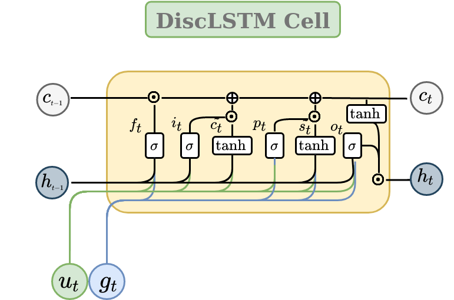

## DiscLSTM

PyTorch Code for [A Discourse Aware Sequence Learning Approach for Emotion Recognition in Conversations](https://arxiv.org/abs/2203.16799)

### DiscLSTM Cell Representation:

.

Dependency Graphs : https://drive.google.com/drive/folders/14fMl_APuJ9S0y-2vwewzlC64_nYj7mum?usp=sharing

## Cite

If you find this work useful, please do cite our paper:  
```
@misc{https://doi.org/10.48550/arxiv.2203.16799,
  doi = {10.48550/ARXIV.2203.16799},
  url = {https://arxiv.org/abs/2203.16799},
  author = {Ghosh, Sreyan and Srivastava, Harshvardhan and Umesh, S.},
  keywords = {Computation and Language (cs.CL), FOS: Computer and information sciences, FOS: Computer and information sciences},
  title = {A Discourse Aware Sequence Learning Approach for Emotion Recognition in Conversations},
  publisher = {arXiv},
  year = {2022},
  copyright = {Creative Commons Attribution Non Commercial Share Alike 4.0 International}
}
```